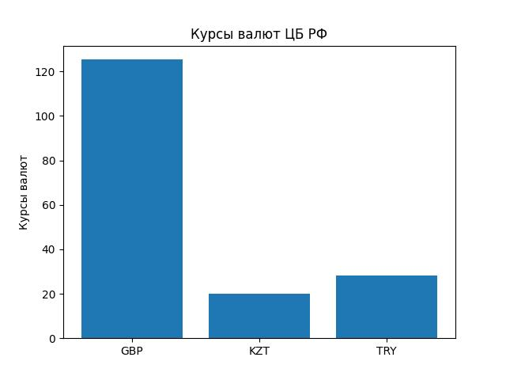

# Лабораторная работа №5
## Структура файлов проекта:

currencies.py — основной класс с реализацией паттерна "Одиночка" и методами для получения курсов валют, а также визуализации.

test_currencies.py — тесты для проверки корректной работы кода, включая проверку на одиночку, получение данных, частоту запросов и неверные ID.

## Гистограмма курса валют:
